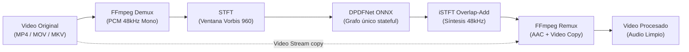

# denoise — Video Speech Enhancement & Noise Removal CLI

[](LICENSE)
[](https://www.rust-lang.org/)
[](https://github.com/CristianRojas-SoftwareEngineer/Denoise/releases/tag/v1.0.0)

**`denoise`** es una herramienta de línea de comandos de alto rendimiento, autocontenida y multiplataforma escrita en **Rust**, diseñada para suprimir ruido de fondo y maximizar la inteligibilidad de la voz en grabaciones de video mediante redes neuronales profundas (**DPDFNet ONNX** + **ONNX Runtime CPU**).

> [!NOTE]
> **Cero Pérdida de Calidad de Video**: El procesamiento de video utiliza copia de flujo directa (*stream copy*, `-c:v copy`). La resolución, tasa de cuadros (fps), perfil de color y compresión de video original permanecen 100% inalterados.

---

## ⚡ Inicio Rápido (Quick Start)

En menos de un minuto puedes tener la herramienta compilada y procesando tu primer video:

```bash
# 1. Clonar el repositorio
git clone https://github.com/CristianRojas-SoftwareEngineer/Denoise.git
cd Denoise

# 2. Compilar binario optimizado
cargo build --release

# 3. Ejecutar denoise sobre un video
./target/release/denoise "screencast_demo.mp4"
# Genera: screencast_demo_denoised.mp4 con audio limpio (sin normalización)
```

---

## 📑 Tabla de Contenidos

- [Características Principales](#-características-principales)
- [Instalación y Requisitos](#-instalación-y-requisitos)
- [Guía de Uso y Ejemplos](#-guía-de-uso-y-ejemplos)
- [Referencia de Comandos CLI](#-referencia-de-comandos-cli)
- [Arquitectura y Funcionamiento Interno](#-arquitectura-y-funcionamiento-interno)
- [Desarrollo y Tests](#-desarrollo-y-tests)
- [Estructura del Proyecto](#-estructura-del-proyecto)
- [Licencia y Atribuciones](#-licencia-y-atribuciones)

---

## ✨ Características Principales

- 🎙️ **Denoise Neuronal de Última Generación**: Utiliza DPDFNet (`dpdfnet8_48khz_hr.onnx`, grafo único stateful a 48 kHz) para separar eficazmente voz humana de ruidos continuos o transitorios (ventiladores, tráfico, reverberación, tecleo). Salida bit-exacta respecto a sherpa-onnx (1 LSB PCM16).
- ⚡ **Stream Copy de Video Inalterado (`-c:v copy`)**: Sin recodificación de video, logrando tiempos de ejecución sumamente veloces y preservación visual idéntica al original.
- 🎚️ **Sin Normalización Artificial**: La salida conserva la escala exacta del modelo (sin ganancia global ni limiter), lo que garantiza paridad con la referencia y máxima fidelidad.
- 🔄 **Sincronización A/V Cuidadosa**: Manejo robusto de contenedores con *edit lists* (`-ignore_editlist 1`) para evitar cualquier desfase temporal entre video y audio procesado.
- 📁 **Procesamiento Masivo y Automatización**: Soporta lotes de archivos, exploración de carpetas recursiva (`--recursive`), prefijos/sufijos y omisión de archivos existentes (`--skip-existing`).
- 🤖 **Modo Headless / CI / Scripts (`--json`)**: Emite reportes estructurados en formato JSON y códigos de salida estándar para pipelines de producción.
- 📦 **Autodescarga y Validación de Modelos**: Descarga el modelo ONNX en el primer uso a `~/.cache/denoise/models` con verificación criptográfica SHA-256.
- 🌐 **Multiplataforma Nativa**: Funciona de forma nativa en Windows, Linux y macOS (tanto Intel x86_64 como Apple Silicon ARM64).

---

## 📥 Instalación y Requisitos

### Requisitos Previos

1. **Rust 1.88+**: Instálalo o actualízalo con [rustup](https://rustup.rs/):
   ```bash
   rustup update stable
   ```
2. **FFmpeg 6.0+**: Debe estar disponible en el `PATH` del sistema.

#### Instalación de FFmpeg por Sistema Operativo

| Sistema Operativo | Comando de Instalación Recomendado |
|:--- |:--- |
| **Windows** | `winget install Gyan.FFmpeg` &nbsp;*(o `choco install ffmpeg`)* |
| **macOS** | `brew install ffmpeg` |
| **Linux (Ubuntu / Debian)** | `sudo apt update && sudo apt install ffmpeg` |
| **Linux (Arch)** | `sudo pacman -S ffmpeg` |

### Compilación desde Código Fuente

```bash
cargo build --release
```

El binario ejecutable compilado estará ubicado en:
- **Windows**: `target\release\denoise.exe`
- **Linux / macOS**: `target/release/denoise`

*(Opcional) Instalar directamente en el PATH de Cargo:*
```bash
cargo install --path.
```

---

## 📖 Guía de Uso y Ejemplos

### 1. Procesamiento de un Video Individual
Aplica reducción de ruido a un video individual. Por defecto, genera `<nombre>_denoised.mp4` en la misma carpeta:
```bash
denoise "tutorial_screencast_01.mp4"
# Salida: tutorial_screencast_01_denoised.mp4
```

### 2. Directorio y Nombre de Salida Personalizado
Útil para procesar tomas crudas y ordenarlas en carpetas de producción:
```bash
denoise "raw_interview_take_03.mov" \
  --output-dir "./processed_videos" \
  --output-name "interview_take_03_clean"
# Salida:./processed_videos/interview_take_03_clean.mp4
```

### 3. Procesamiento por Lote con Prefijos y Bitrate de Audio
Procesa todos los videos de una carpeta, añadiendo prefijos identificadores y configurando un bitrate AAC específico:
```bash
denoise "./raw_takes/" \
  --output-dir "./clean_takes/" \
  --prefix "final_" \
  --suffix "_voice_enhanced" \
  --audio-bitrate 192
```

### 4. Modo Recursivo para Cursos o Grabaciones Múltiples
Explora subdirectorios completos y omite archivos ya procesados en ejecuciones anteriores:
```bash
denoise "./Curso_Rust_2026/" \
  --recursive \
  --output-dir "./Curso_Rust_2026_Denoised/" \
  --skip-existing
```

> [!TIP]
> `--skip-existing` es ideal para reanudar trabajos de procesamiento interrumpidos sin repetir trabajo sobre archivos ya completados.

### 5. Integración con Pipelines de Automatización (Salida JSON)
Permite capturar el estado y métricas de procesamiento directamente desde scripts de Node.js, Python o CI/CD:
```bash
denoise "./ingest/" --output-dir "./distribution/" --json
```

**Ejemplo de salida estructurada (`--json` = JSONL, una línea por archivo + resumen final):**
```json
{"input":"ingest/module_1.mp4","output":"distribution/module_1_denoised.mp4","status":"ok","message":"24.10 MB, 38.0s","pct":100}
{"input":"ingest/module_2.mp4","output":"distribution/module_2_denoised.mp4","status":"ok","message":"18.55 MB, 31.2s","pct":100}
{"summary":{"ok":2,"failed":0,"skipped":0}}
```

### 6. Rutas Personalizadas para Entornos Especiales
Si FFmpeg o los modelos se encuentran en rutas personalizadas o no estándar:
```bash
denoise "podcast_episode_12.mp4" \
  --ffmpeg-path "C:\tools\ffmpeg\bin\ffmpeg.exe" \
 --model-dir "D:\AI_Models\DPDFNet"
```

---

## 🎛️ Referencia de Comandos CLI

```text
Uso: denoise [OPCIONES] <INPUT>...
```

| Argumento / Opción | Tipo | Valor por Defecto | Descripción |
|:--- |:--- |:--- |:--- |
| `<INPUT>...` | Posicional | *(Obligatorio)* | Uno o más archivos de video o carpetas a procesar. |
| `--output-dir <DIR>` | Opción | Directorio de origen | Directorio destino para los videos generados. |
| `-o`, `--output-name <NAME>` | Opción | `None` | Nombre base del archivo de salida (válido únicamente para 1 video). |
| `--prefix <TEXT>` | Opción | `""` | Prefijo que se antepondrá al nombre del archivo generado. |
| `--suffix <TEXT>` | Opción | `"_denoised"` | Sufijo que se agregará antes de la extensión del archivo generado. |
| `--audio-bitrate <KBPS>` | Opción | `192` | Bitrate del audio AAC de salida en kbps (rango 64-320) (ej: 128, 192, 256). |
| `--recursive` | Flag | `false` | Búsqueda recursiva de videos al especificar directorios. |
| `--overwrite` | Flag | `false` | Sobrescribe el archivo destino si ya existe (excluyente con `--skip-existing`). |
| `--skip-existing` | Flag | `false` | Omite el procesamiento si el archivo destino ya existe. |
| `--dry-run` | Flag | `false` | Simula el lote sin escribir nada ni invocar ffmpeg/modelo. |
| `--verbose` | Flag | `false` | Muestra depuración detallada a `stderr` y conserva temporales. |
| `--json` | Flag | `false` | Emite el reporte consolidado final en formato JSON estructurado. |
| `--ffmpeg-path <PATH>` | Opción | `None` (detectado en PATH) | Ruta explícita al ejecutable de `ffmpeg`. |
| `--model-dir <DIR>` | Opción | `~/.cache/denoise/models` | Directorio local donde se almacenan los modelos ONNX. |
| `-h`, `--help` | Flag | — | Muestra la ayuda del CLI. |
| `-V`, `--version` | Flag | — | Muestra la versión actual de la herramienta. |

### Códigos de Salida del Proceso

- **`0`**: Procesamiento completado con éxito para todos los archivos.
- **`1`**: Error general o procesamiento parcial (al menos un archivo falló en el lote).
- **`2`**: Error en los argumentos del CLI o validaciones de entrada.
- **`3`**: Cancelación por `Ctrl+C` (temporales y `.part` borrados).

---

## 🔬 Arquitectura y Funcionamiento Interno



1. **Demux y Extracción de Audio (`ffmpeg_io.rs`)**: FFmpeg extrae la primera pista de audio a WAV mono 48 kHz PCM16 (`-map 0:a:0 -vn -ac 1 -ar 48000`), que `df/mod.rs` lee como `i16` vía `hound` (`/32768.0`).
2. **Transformada Tiempo-Frecuencia (`stft.rs`)**: Divide la señal en tramas de 960 muestras (20 ms a 48 kHz) con 50% de solapamiento y ventana Vorbis (cumpliendo la condición de reconstrucción perfecta de Princen-Bradley).
3. **Inferencia Neuronal DPDFNet (`df/net.rs`)**: Grafo único stateful (`spec` + `state_in` → `spec_e` + `state_out`) ejecutado frame a frame por ONNX Runtime CPU, encadenando el estado recurrente sin trocear ni reiniciar. Sin bandas ERB externas: la normalización ocurre dentro del grafo.
4. **Síntesis iSTFT (`df/stft.rs`)**:
 - Reconstruye la señal en el dominio del tiempo mediante iSTFT con síntesis *Overlap-Add* (réplica exacta de `knf::IStft` + recorte de 1920 muestras de sherpa-onnx).
 - Sin normalización ni limiter: la escala es la del modelo, bit-exacta con la referencia.
5. **Remux de Video sin Pérdida (`ffmpeg_io.rs`)**: FFmpeg reensambla el contenedor combinando el flujo original de video (`-c:v copy`) con la nueva pista de audio codificada en AAC.

---

## 🧪 Desarrollo y Tests

### Ejecución de Pruebas

```bash
# Ejecutar suite de pruebas unitarias y de integración estándar
cargo test

# Ejecutar tests de integración completos (incluyendo inferencia ONNX y remux con FFmpeg)
cargo test -- --ignored
```

### Video manual de prueba
Fixture real `assets/e2e_vertical_1080x1920_16s.mp4` (vertical 1080x1920, 16s, con audio) para probar casos de uso sin generar nada:
```bash
cargo build --release
./target/release/denoise assets/e2e_vertical_1080x1920_16s.mp4 --dry-run
```

---

## 📂 Estructura del Proyecto

```text
├── Cargo.toml # Manifiesto del proyecto y dependencias de crates
├── src/
│ ├── main.rs # Punto de entrada de la aplicación
│ ├── lib.rs # Exportación de módulos para biblioteca y tests
│ ├── cli.rs # Definición de CLI con Clap y resolución de lotes
│ ├── pipeline.rs # Orquestador del pipeline completo de video/audio
│ ├── ffmpeg_io.rs # Invocación estructurada de FFmpeg (demux/remux/probe)
│ ├── models.rs # Descarga y verificación SHA-256 de modelos ONNX
│ ├── errors.rs # Tipos de errores fuertemente tipados y códigos de salida
│ └── df/ # Núcleo DSP y procesamiento DPDFNet
│ ├── stft.rs # STFT / iSTFT con ventana Vorbis 960 (48 kHz)
│ ├── net.rs # Sesión stateful DPDFNet con ONNX Runtime CPU (`ort`)
│ └── mod.rs # Orquestación WAV → WAV del pipeline
├── docs/ # Documentación técnica de diseño y especificación
│ ├── design.md # Arquitectura detallada, DSP y contratos de interfaz
│ ├── specifications.md # Especificación de requerimientos RF, RNF y DoD
├── assets/ # Fixture manual E2E (`e2e_vertical_1080x1920_16s.mp4`)
├── examples/gen_vectors.rs # Generador de vectores con voz real del EvalSet
├── tests/ # Tests de integración y validación con golden vectors
│ ├── common/si_sdr.rs # Helper SI-SDR Rust puro
│ ├── data/*.wav + README.md # Vectores versionados + descripción
└── CHANGELOG.md # Registro de versiones y notas de lanzamiento
```

---

## 📄 Licencia y Atribuciones

- **Código fuente**: Licenciado bajo [MIT License](LICENSE).
- **Modelo DPDFNet**: Desarrollado por Ceva-IP ([Ceva-IP/DPDFNet](https://github.com/ceva-ip/DPDFNet), variante `dpdfnet8_48khz_hr.onnx`), bajo licencia Apache 2.0.
- **FFmpeg**: Herramienta multimedia externa licenciada bajo LGPL/GPL.
