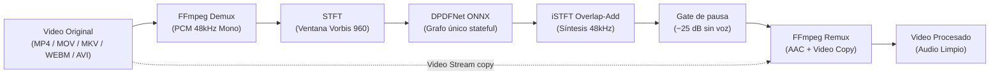

# denoise — Video Speech Enhancement & Noise Removal CLI

[](LICENSE)
[](https://www.rust-lang.org/)
[](https://github.com/CristianRojas-SoftwareEngineer/Denoise/releases/tag/v1.0.0)

**`denoise`** es una herramienta de línea de comandos de alto rendimiento, autocontenida y multiplataforma escrita en **Rust**, diseñada para suprimir ruido de fondo y maximizar la inteligibilidad de la voz en grabaciones de video mediante redes neuronales profundas (**DPDFNet ONNX** + **ONNX Runtime CPU**).

> [!NOTE]
> **Cero Pérdida de Calidad de Video**: El procesamiento de video utiliza copia de flujo directa (*stream copy*, `-c:v copy`). La resolución, tasa de cuadros (fps), perfil de color y compresión de video original permanecen 100% inalterados.

---

## 1. ⚡ Inicio Rápido (Quick Start)

En menos de un minuto (tras la compilación en release) puedes tener la herramienta procesando tu primer video:

```bash
# 1. Clonar el repositorio
git clone https://github.com/CristianRojas-SoftwareEngineer/Denoise.git
cd Denoise

# 2. Compilar binario optimizado
cargo build --release

# 3. Ejecutar denoise sobre un video
./target/release/denoise "screencast_demo.mp4"
# Genera: screencast_demo_denoised.mp4
```

### 1.1. Coste del primer uso

La primera ejecución descarga el modelo DPDFNet (~15 MB) a `~/.cache/denoise/models` y necesita conexión a internet. Ten en cuenta:

- **Red**: requerida solo en la primera corrida; después el modelo se cachea y funciona offline.
- **Verificación**: la descarga se valida con SHA-256 y se reintenta hasta 3 veces antes de fallar con `E_MODEL_MISSING`.
- **Espacio en disco**: se requieren ~50 MB libres en el directorio del modelo; sin ellos la ejecución falla con `E_IO`.
- **Integridad**: la descarga se hace en un archivo temporal y solo se renombra al completarse, así que una interrupción no deja un modelo corrupto.

Para un proceso ya descargado o para redes restringidas, usa `--model-dir` con una copia local del modelo.

---

## 📑 Tabla de Contenidos

1. [⚡ Inicio Rápido (Quick Start)](#1--inicio-rápido-quick-start)
   - [1.1. Coste del primer uso](#11-coste-del-primer-uso)
2. [✨ Características Principales](#2--características-principales)
3. [📥 Instalación y Requisitos](#3--instalación-y-requisitos)
   - [3.1. Requisitos Previos](#31-requisitos-previos)
   - [3.2. Instalación de FFmpeg por Sistema Operativo](#32-instalación-de-ffmpeg-por-sistema-operativo)
   - [3.3. Compilación desde Código Fuente](#33-compilación-desde-código-fuente)
4. [📖 Guía de Uso y Ejemplos](#4--guía-de-uso-y-ejemplos)
   - [4.1. Procesamiento de un Video Individual](#41-procesamiento-de-un-video-individual)
   - [4.2. Directorio y Nombre de Salida Personalizado](#42-directorio-y-nombre-de-salida-personalizado)
   - [4.3. Procesamiento por Lote con Prefijos y Bitrate de Audio](#43-procesamiento-por-lote-con-prefijos-y-bitrate-de-audio)
   - [4.4. Modo Recursivo para Cursos o Grabaciones Múltiples](#44-modo-recursivo-para-cursos-o-grabaciones-múltiples)
   - [4.5. Integración con Pipelines de Automatización (Salida JSON)](#45-integración-con-pipelines-de-automatización-salida-json)
   - [4.6. Rutas Personalizadas para Entornos Especiales](#46-rutas-personalizadas-para-entornos-especiales)
5. [🎛️ Referencia de Comandos CLI](#5--referencia-de-comandos-cli)
   - [5.1. Códigos de Salida del Proceso](#51-códigos-de-salida-del-proceso)
6. [⚠️ Limitaciones Conocidas](#6--limitaciones-conocidas)
7. [🩺 Troubleshooting](#7--troubleshooting)
8. [🔬 Arquitectura y Funcionamiento Interno](#8--arquitectura-y-funcionamiento-interno)
9. [🧪 Desarrollo y Tests](#9--desarrollo-y-tests)
   - [9.1. Ejecución de Pruebas](#91-ejecución-de-pruebas)
   - [9.2. Video manual de prueba](#92-video-manual-de-prueba)
   - [9.3. Benchmark de calidad de audio](#93-benchmark-de-calidad-de-audio)
10. [📂 Estructura del Proyecto](#10--estructura-del-proyecto)
11. [📄 Licencia y Atribuciones](#11--licencia-y-atribuciones)

---

## 2. ✨ Características Principales

- 🎙️ **Denoise Neuronal de Última Generación**: Utiliza DPDFNet (`dpdfnet8_48khz_hr.onnx`, grafo único stateful a 48 kHz) para separar eficazmente voz humana de ruidos continuos o transitorios (ventiladores, tráfico, reverberación, tecleo). La voz sale con la escala exacta del modelo (×1.0); un gate de pausa atenúa −25 dB las zonas sin voz (ver [docs/design.md](docs/design.md) §6).
- ⚡ **Stream Copy de Video Inalterado (`-c:v copy`)**: Sin recodificación de video, logrando tiempos de ejecución sumamente veloces y preservación visual idéntica al original.
- 🎚️ **Sin Normalización Artificial**: No hay ganancia global ni limiter: la voz conserva la escala exacta del modelo (×1.0) y solo las pausas se atenúan con el gate de pausa (−25 dB), sin reescalar la señal.
- 🔄 **Sincronización A/V Cuidadosa**: Manejo robusto de contenedores con *edit lists* (`-ignore_editlist 1`, solo en `mov/mp4/m4v/m4a/3gp/3g2/mj2`) para evitar cualquier desfase temporal entre video y audio procesado.
- 📁 **Procesamiento Masivo y Automatización**: Soporta lotes de archivos, exploración de carpetas recursiva (`--recursive`), prefijos/sufijos y omisión de archivos existentes (`--skip-existing`).
- 🤖 **Modo Headless / CI / Scripts (`--json`)**: Emite reportes estructurados en formato JSON y códigos de salida estándar para pipelines de producción.
- 📦 **Autodescarga y Validación de Modelos**: Descarga el modelo ONNX en el primer uso a `~/.cache/denoise/models` con verificación criptográfica SHA-256.
- 🌐 **Multiplataforma Nativa**: Funciona de forma nativa en Windows, Linux y macOS (tanto Intel x86_64 como Apple Silicon ARM64).

---

## 3. 📥 Instalación y Requisitos

### 3.1. Requisitos Previos

1. **Rust 1.88+**: Instálalo o actualízalo con [rustup](https://rustup.rs/):
   ```bash
   rustup update stable
   ```
2. **FFmpeg 6.0+**: Debe estar disponible en el `PATH` del sistema. Verifícalo con `ffmpeg -version` (la versión debe ser 6 o superior; también se aceptan builds `N-` de nightly). Si no se detecta, la ejecución falla con `E_FFMPEG_NOT_FOUND`.

### 3.2. Instalación de FFmpeg por Sistema Operativo

| Sistema Operativo | Comando de Instalación Recomendado |
|:--- |:--- |
| **Windows** | `winget install Gyan.FFmpeg` &nbsp;*(o `choco install ffmpeg`)* |
| **macOS** | `brew install ffmpeg` |
| **Linux (Ubuntu / Debian)** | `sudo apt update && sudo apt install ffmpeg` |
| **Linux (Arch)** | `sudo pacman -S ffmpeg` |

### 3.3. Compilación desde Código Fuente

```bash
cargo build --release
```

El binario ejecutable compilado estará ubicado en:
- **Windows**: `target\release\denoise.exe`
- **Linux / macOS**: `target/release/denoise`

*(Opcional) Instalar directamente en el PATH de Cargo:*
```bash
cargo install --path .
```

---

## 4. 📖 Guía de Uso y Ejemplos

### 4.1. Procesamiento de un Video Individual
Aplica reducción de ruido a un video individual. Por defecto, genera `<nombre>_denoised.mp4` en la misma carpeta:
```bash
denoise "tutorial_screencast_01.mp4"
# Salida: tutorial_screencast_01_denoised.mp4
```

### 4.2. Directorio y Nombre de Salida Personalizado
Útil para procesar tomas crudas y ordenarlas en carpetas de producción:
```bash
denoise "raw_interview_take_03.mov" \
  --output-dir "./processed_videos" \
  --output-name "interview_take_03_clean"
# Salida: ./processed_videos/interview_take_03_clean.mp4 (la extensión .mp4 se añade automáticamente)
```

### 4.3. Procesamiento por Lote con Prefijos y Bitrate de Audio
Procesa todos los videos de una carpeta, añadiendo prefijos identificadores y configurando un bitrate AAC específico:
```bash
denoise "./raw_takes/" \
  --output-dir "./clean_takes/" \
  --prefix "final_" \
  --suffix "_voice_enhanced" \
  --audio-bitrate 256
```

### 4.4. Modo Recursivo para Cursos o Grabaciones Múltiples
Explora subdirectorios completos y omite archivos ya procesados en ejecuciones anteriores:
```bash
denoise "./Curso_Rust_2026/" \
  --recursive \
  --output-dir "./Curso_Rust_2026_Denoised/" \
  --skip-existing
```

> [!TIP]
> `--skip-existing` es ideal para reanudar trabajos de procesamiento interrumpidos sin repetir trabajo sobre archivos ya completados.

> [!NOTE]
> Con `--recursive` se excluyen del escaneo los archivos `*<suffix>.mp4` (evita `*_denoised_denoised.mp4`) y el `output-dir` si está anidado dentro del directorio de entrada. Exclusiones fuera de `cwd` se anuncian solo con `--verbose`.

### 4.5. Integración con Pipelines de Automatización (Salida JSON)
Permite capturar el estado y métricas de procesamiento directamente desde scripts de Node.js, Python o CI/CD. Valida siempre el lote antes de ejecutarlo:
```bash
denoise "./ingest/" --output-dir "./distribution/" --dry-run
denoise "./ingest/" --output-dir "./distribution/" --json
```

**Salida:** `--json` emite **JSONL en streaming a `stdout`** (el progreso humano se suprime y va a `stderr`): una línea por evento de progreso, una línea final por archivo con `pct=100`, y una última línea de resumen. `status` ∈ `ok` | `failed` | `skipped` | `dry-run`; `skipped` y `dry-run` siempre reportan `pct=0` (nunca se procesaron).

```json
{"input":"ingest/module_1.mp4","output":"distribution/module_1_denoised.mp4","status":"ok","message":"extrayendo audio","pct":1}
{"input":"ingest/module_1.mp4","output":"distribution/module_1_denoised.mp4","status":"ok","message":"24.10 MB, 38.0s","pct":100}
{"input":"ingest/module_2.mp4","output":"distribution/module_2_denoised.mp4","status":"skipped","message":"skipped","pct":0}
{"summary":{"ok":1,"failed":0,"skipped":1}}
```

Como cada línea es un objeto JSON independiente, se puede filtrar en streaming:
```bash
denoise "./ingest/" --output-dir "./distribution/" --json | jq -c 'select(.status != "ok")'
```

### 4.6. Rutas Personalizadas para Entornos Especiales
Si FFmpeg o los modelos se encuentran en rutas personalizadas o no estándar:
```bash
denoise "podcast_episode_12.mp4" \
  --ffmpeg-path "C:\tools\ffmpeg\bin\ffmpeg.exe" \
  --model-dir "D:\AI_Models\DPDFNet"
```

---

## 5. 🎛️ Referencia de Comandos CLI

```text
Uso: denoise [OPCIONES] <INPUT>...
```

| Argumento / Opción | Tipo | Valor por Defecto | Descripción |
|:--- |:--- |:--- |:--- |
| `<INPUT>...` | Posicional | *(Obligatorio)* | Uno o más archivos de video o carpetas a procesar. |
| `--output-dir <DIR>` | Opción | Junto al original | Directorio destino. Sin `--output-dir`: junto al original; con `--output-name` solo: `cwd`; con `--recursive`: recrea el árbol relativo a `cwd`. |
| `-o`, `--output-name <NAME>` | Opción | `None` | Nombre base de salida (solo si el lote expandido == 1 video; `prefix`/`suffix` se ignoran; auto-añade `.mp4`; complementario con `--output-dir`). |
| `--prefix <TEXT>` | Opción | `""` | Prefijo del archivo generado. Solo `[A-Za-z0-9._-]`, no `.`/`..`. |
| `--suffix <TEXT>` | Opción | `"_denoised"` | Sufijo antes de la extensión. Mismas reglas que `--prefix`. |
| `--audio-bitrate <KBPS>` | Opción | `192` | Bitrate del audio AAC de salida en kbps (rango 64-320) (ej: 128, 192, 256). |
| `--recursive` | Flag | `false` | Búsqueda recursiva de videos al especificar directorios. |
| `--overwrite` | Flag | `false` | Sobrescribe el destino si ya existe (excluyente con `--skip-existing`). Sin flags + destino existe → error `E_OUTPUT_EXISTS` (exit `2`). |
| `--skip-existing` | Flag | `false` | Omite el procesamiento si el archivo destino ya existe. |
| `--dry-run` | Flag | `false` | Simula el lote sin escribir nada ni invocar ffmpeg/modelo (`exit 0`, `pct=0`). |
| `--verbose` | Flag | `false` | Muestra depuración detallada a `stderr` y conserva temporales (`.tmp.*.wav`, `.part.mp4`). |
| `--json` | Flag | `false` | Emite JSONL en streaming a `stdout` (líneas de progreso + línea final por archivo + resumen). |
| `--ffmpeg-path <PATH>` | Opción | `None` (detectado en PATH) | Ruta explícita al ejecutable de `ffmpeg` (debe existir). |
| `--model-dir <DIR>` | Opción | `~/.cache/denoise/models` | Directorio local de los modelos ONNX. |
| `-h`, `--help` | Flag | — | Muestra la ayuda del CLI. |
| `-V`, `--version` | Flag | — | Muestra `denoise <ver> + modelo DPDFNet + ffmpeg <ver>`. |

> [!NOTE]
> Colisión intra-lote (`a.mp4` + `a.mov` → mismo `a_denoised.mp4`): la salida se renombra a `_1`, `_2`… con aviso a `stderr`. Ambos `prefix`+`suffix` vacíos con salida in-place → `E_INVALID_INPUT`.

> [!NOTE]
> Los directorios de destino (`--output-dir`, `--output-name`, `--model-dir`) se crean automáticamente, incluidos sus directorios padre. Si no pueden crearse por permisos o por una ruta inválida, la ejecución falla con `E_IO` (exit `1`) sin dejar archivos parciales.

### 5.1. Códigos de Salida del Proceso

- **`0`**: Procesamiento completado con éxito para todos los archivos.
- **`1`**: Error general o procesamiento parcial (al menos un archivo falló en el lote).
- **`2`**: Error en los argumentos del CLI o validaciones de entrada.
- **`3`**: Cancelación por `Ctrl+C` (temporales y `.part` borrados).

> [!NOTE]
> En un lote, el proceso **nunca se aborta** por un archivo fallido: continúa con el resto y devuelve el peor código de salida (`1` tiene prioridad sobre `2`; `3` por cancelación siempre gana).

---

## 6. ⚠️ Limitaciones Conocidas

- **Audio mono 48 kHz**: se procesa únicamente la primera pista de audio, convertida a mono 48 kHz. Las pistas de audio adicionales del original **no se conservan** en la salida.
- **Solo el primer stream de video**: se copia `0:v:0`; el resto de streams de video se descartan.
- **Sin subtítulos ni metadatos**: los subtítulos, capítulos y metadatos del contenedor original **no** se copian a la salida.
- **Procesamiento secuencial**: los videos de un lote se procesan uno a uno, sin paralelismo. La inferencia es CPU-only (no usa GPU).
- **Sin normalización ni loudness**: no hay ganancia global ni limiter; la voz conserva la escala exacta del modelo y solo las pausas se atenúan (gate de pausa, −25 dB). Si el audio resultante queda muy bajo de volumen, es el comportamiento esperado; la herramienta no aplica ganancia automática.
- **Remux a MP4**: la salida es siempre `.mp4` (con stream copy del video), independientemente de la extensión del archivo de entrada.

---

## 7. 🩺 Troubleshooting

| Síntoma / Error | Exit | Causa | Solución |
|:--- |:--- |:--- |:--- |
| `E_FFMPEG_NOT_FOUND` | `1` | ffmpeg no está en el `PATH` o es anterior a 6.0 | Instálalo (ver [3. Instalación y Requisitos](#3--instalación-y-requisitos)) o usa `--ffmpeg-path`. Verifica con `ffmpeg -version`. |
| `E_NO_AUDIO` | `2` | El vídeo no contiene ninguna pista de audio | Usa un vídeo con audio; no es un error de la herramienta. |
| `E_INVALID_INPUT` | `2` | Ruta inexistente, archivo sin stream de vídeo (solo audio), archivo corrupto, extensión no soportada, `--output-name` con lote > 1, `prefix`+`suffix` vacíos en in-place, `--output-name` que resuelve a la propia entrada, o `--audio-bitrate` fuera de 64-320 | Corrige la entrada o los argumentos. Un vídeo sin pista de audio devuelve `E_NO_AUDIO`, no `E_INVALID_INPUT`. |
| `E_OUTPUT_EXISTS` | `2` | El archivo de salida ya existe y no se pasó `--overwrite` ni `--skip-existing` | Añade `--overwrite` para sustituir o `--skip-existing` para omitir. |
| `E_MODEL_MISSING` | `1` | Fallo al descargar el modelo (red, timeout de 60 s o SHA-256 incorrecto tras 3 intentos) | Reintenta; si persiste, descarga el modelo manualmente y colócalo en `--model-dir`. Una descarga interrumpida no deja el modelo corrupto: el fichero parcial se descarta. |
| `E_IO` | `1` | Permisos insuficientes, disco lleno (<50 MB para el modelo) o ruta no creable | Verifica permisos y espacio libre, o cambia `--output-dir` / `--model-dir`. |
| `E_FFMPEG_FAILED` | `1` | ffmpeg falló al extraer o reensamblar | Verifica que el vídeo no esté corrupto y que ffmpeg 6+ esté correctamente instalado. |
| Cancelación | `3` | Pulsaste `Ctrl+C` | Los temporales se limpian automáticamente. Relanza con `--skip-existing` para reanudar. |
| Salida con cola muda | `0` | El audio limpio es más corto que el video | Comportamiento esperado: la duración de salida sigue la del contenedor de entrada. |

Para depurar un caso concreto, añade `--verbose` (detalla en `stderr` las exclusiones del escaneo y las decisiones de nomenclatura, y conserva los temporales `.tmp.*.wav` / `.part.mp4` para inspeccionarlos) y usa `--dry-run` para validar el lote sin procesar.

---

## 8. 🔬 Arquitectura y Funcionamiento Interno



1. **Demux y Extracción de Audio (`ffmpeg_io.rs`)**: FFmpeg extrae la primera pista de audio a WAV mono 48 kHz PCM16 (`-map 0:a:0 -vn -ac 1 -ar 48000`), que `df/mod.rs` lee como `i16` vía `hound` (`/32768.0`).
2. **Transformada Tiempo-Frecuencia (`stft.rs`)**: Divide la señal en tramas de 960 muestras (20 ms a 48 kHz) con 50% de solapamiento y ventana Vorbis (cumpliendo la condición de reconstrucción perfecta de Princen-Bradley).
3. **Inferencia Neuronal DPDFNet (`df/net.rs`)**: Grafo único stateful (`spec` + `state_in` → `spec_e` + `state_out`) ejecutado frame a frame por ONNX Runtime CPU, encadenando el estado recurrente sin trocear ni reiniciar. Sin bandas ERB externas: la normalización ocurre dentro del grafo.
4. **Síntesis iSTFT (`df/stft.rs`)**:
 - Reconstruye la señal en el dominio del tiempo mediante iSTFT con síntesis *Overlap-Add* (réplica exacta de `knf::IStft` + recorte de 1920 muestras de sherpa-onnx).
 - Sin normalización ni limiter: la escala es la del modelo.
5. **Gate de pausa (`df/mod.rs`)**: un VAD solo-salida sobre RMS de marcos de 30 ms (voz a ≥ pico−30 dB, salida con histéresis a ≤ pico−45 dB tras 3 marcos, hangover de 5) atenúa −25 dB las pausas con fundidos raised-cosine, justo antes de cuantizar a PCM16. Solo atenuación de no-voz: la voz queda multiplicada por 1.0 (sin ganancia, normalización global ni limiter; detalle en [docs/design.md](docs/design.md) §6).
6. **Remux de Video sin Pérdida (`ffmpeg_io.rs`)**: FFmpeg reensambla el contenedor combinando el flujo original de video (`-c:v copy`) con la nueva pista de audio codificada en AAC al bitrate solicitado. La duración de la salida se toma de la duración del contenedor de entrada, por lo que si el audio limpio resultante es más corto que el video, los últimos milisegundos quedan en silencio (comportamiento esperado, no un error). El detalle exacto de los argumentos está en [docs/design.md](docs/design.md).

---

## 9. 🧪 Desarrollo y Tests

### 9.1. Ejecución de Pruebas

Las pruebas se dividen en dos niveles:

```bash
# Suite rápida: nomenclatura, errores y reportería.
# Requiere ffmpeg 6+ real en el PATH, pero NO red ni modelo ONNX.
cargo test

# Suite pesada (#[ignore]): vectores dorados de audio con inferencia ONNX real
# y remux con FFmpeg. Tarda varios minutos.
cargo test --release -- --ignored
```

Qué cubre cada nivel:

| Nivel | Contenido |
|:--- |:--- |
| `cargo test` | `test_naming` (resolución de nombres, colisiones, recursión), `test_errors` (códigos de error con `FakeProvider`), `test_reporter` (orden y JSONL), `test_stft` (reconstrucción y delay) |
| `cargo test --release -- --ignored` | `test_golden` (mejora ≥5 dB y paridad ≥60 dB frente a la referencia) y `test_remux` (stream copy y hash de vídeo) |

> [!NOTE]
> Estado tras el gate de pausa: `test_golden_3s` (67,77 dB), `test_golden_65s` (100,00 dB, tras re-congelar su referencia con este mismo port sobre `voz65s_noisy.wav`) y `test_remux` están en verde. El umbral ≥60 dB no se relajó: solo se regeneró la expectativa tras validar la mejora (ver [docs/design.md](docs/design.md) §6).

Los vectores dorados son datos versionados en `tests/data/` y **no** se regeneran en CI. Para regenerarlos manualmente se usa el generador con voz real del EvalSet de DPDFNet (la referencia del par 65 s admite además re-congelarse sin EvalSet con `examples/process_wav.rs` sobre `voz65s_noisy.wav`):
```bash
cargo run --release --example gen_vectors -- <dir_eval>
```

### 9.2. Video manual de prueba
Fixture real `assets/e2e_vertical_1080x1920_16s.mp4` (vertical 1080x1920, 16s, con audio) para probar casos de uso sin generar nada:
```bash
cargo build --release
./target/release/denoise assets/e2e_vertical_1080x1920_16s.mp4 --dry-run
```

### 9.3. Benchmark de calidad de audio

Los tests verifican que nada se rompa; el benchmark mide *cuánto* limpia el DSP. Tres métricas complementarias —SI-SDR (ruido eliminado), STOI (voz inteligible) y PESQ (naturalidad)— cuyo significado sin jerga está en [docs/metrics.md](docs/metrics.md):

```bash
pip install -r tools/quality/requirements.txt
python tools/quality/benchmark.py run --set tests_data --work out/bench
```

El comando ejecuta el DSP sobre el set de clips y compara contra la línea base comprometida (`tools/quality/baseline.json`), fallando si alguna métrica cae. El historial de resultados vive en [docs/benchmark.md](docs/benchmark.md); el uso detallado de la herramienta, en [tools/quality/README.md](tools/quality/README.md).

---

## 10. 📂 Estructura del Proyecto

```text
├── Cargo.toml # Manifiesto del proyecto y dependencias de crates
├── src/
│ ├── main.rs # Punto de entrada de la aplicación
│ ├── lib.rs # Exportación de módulos para biblioteca y tests
│ ├── cli.rs # Definición de CLI con Clap y resolución de lotes
│ ├── pipeline.rs # Orquestador del pipeline completo de video/audio
│ ├── ffmpeg_io.rs # Invocación estructurada de FFmpeg (demux/remux/probe)
│ ├── models.rs # Descarga y verificación SHA-256 de modelos ONNX
│ ├── errors.rs # Tipos de errores fuertemente tipados y códigos de salida
 │ └── df/ # Núcleo DSP y procesamiento DPDFNet
 │ │ ├── stft.rs # STFT / iSTFT con ventana Vorbis 960 (48 kHz)
 │ │ ├── net.rs # Sesión stateful DPDFNet con ONNX Runtime CPU (`ort`)
 │ │ └── mod.rs # Orquestación WAV → WAV del pipeline
├── docs/ # Documentación técnica de diseño y especificación
│ ├── design.md # Arquitectura detallada, DSP y contratos de interfaz
│ ├── specifications.md # Especificación de requerimientos RF, RNF y DoD
│ ├── metrics.md # Métricas de calidad de audio explicadas sin jerga
│ ├── benchmark.md # Registro histórico de resultados de calidad
├── tools/quality/ # Benchmark periódico de calidad (SI-SDR, STOI, PESQ)
│ ├── metrics.py # Implementación de las métricas
│ ├── benchmark.py # CLI run/score + puerta de regresión
│ ├── clips.json # Manifiesto de sets de clips
│ ├── baseline.json # Línea base comprometida
│ └── README.md # Uso de la herramienta
├── assets/ # Fixture manual E2E (`e2e_vertical_1080x1920_16s.mp4`)
├── examples/ # Harnesses y generadores (no se distribuyen en el binario)
│ ├── gen_vectors.rs # Generador de vectores con voz real del EvalSet
│ └── process_wav.rs # Ejecuta el DSP sobre pares WAV (para benchmark)
├── tests/ # Tests de integración y validación con golden vectors
│ ├── common/si_sdr.rs # Helper SI-SDR Rust puro
│ ├── data/*.wav + README.md # Vectores versionados + descripción
└── CHANGELOG.md # Registro de versiones y notas de lanzamiento
```

---

## 11. 📄 Licencia y Atribuciones

- **Código fuente**: Licenciado bajo [MIT License](LICENSE).
- **Modelo DPDFNet**: Desarrollado por Ceva-IP ([Ceva-IP/DPDFNet](https://github.com/ceva-ip/DPDFNet), variante `dpdfnet8_48khz_hr.onnx`), bajo licencia Apache 2.0.
- **FFmpeg**: Herramienta multimedia externa licenciada bajo LGPL/GPL.
