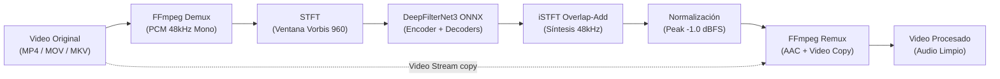

# denoise — Video Speech Enhancement & Noise Removal CLI

[](LICENSE)
[](https://www.rust-lang.org/)
[](https://github.com/CristianRojas-SoftwareEngineer/Noise-Remover/releases/tag/v1.0.0)

**`denoise`** es una herramienta de línea de comandos de alto rendimiento, autocontenida y multiplataforma escrita en **Rust**, diseñada para eliminar ruido de fondo y mejorar la claridad de la voz en grabaciones de video mediante redes neuronales profundas (**DeepFilterNet3 ONNX** + **ONNX Runtime CPU**).

El procesamiento de video se realiza mediante copia directa de flujo (*stream copy*, `-c:v copy`), garantizando **cero pérdida de calidad visual**, preservación de resolución/framerate y tiempos de procesamiento ultrarrápidos.

---

## Características Principales

- 🎙️ **Supresión Neuronal de Ruido (DeepFilterNet3)**: Filtrado profundo de voz en dos etapas (ganancias ERB + filtrado complejo en bajas frecuencias) ejecutado sobre CPU con ONNX Runtime.
- ⚡ **Preservación Total del Video (`-c:v copy`)**: No recodifica la pista de video; únicamente extrae, procesa y reensambla el audio.
- 🎚️ **Normalización de Pico (-1.0 dBFS)**: Compensa automáticamente la reducción de ganancia percibida post-denoise, asegurando una voz clara con volumen consistente sin clipping.
- 🔄 **Sincronización A/V Precisa**: Manejo robusto de *edit lists* en contenedores MP4/MOV (`-ignore_editlist 1`) para evitar desfases temporales entre audio y video.
- 📁 **Procesamiento Individual y por Lotes**: Soporte para archivos individuales, directorios completos, búsqueda recursiva (`--recursive`), prefijos/sufijos y salto de archivos existentes (`--skip-existing`).
- 🤖 **Integración CI/CD y Automatización**: Salida estructurada en formato JSON (`--json`) y códigos de salida estándar (0 = éxito, 1 = error/parcial, 2 = argumentos inválidos).
- 📦 **Gestión Autónoma de Modelos**: Descarga automática y validación criptográfica (SHA-256) de los modelos ONNX en la caché local (`~/.cache/denoise/models`).

---

## Flujo de Procesamiento



---

## Requisitos del Sistema

- **Rust**: Versión estable `1.88` o superior (`rustup update stable`).
- **FFmpeg**: Versión `6.0` o superior disponible en el `PATH` del sistema (o especificada mediante `--ffmpeg-path`).

### Instalación de FFmpeg por Plataforma

- **Windows**:
  ```powershell
  winget install Gyan.FFmpeg
  # o vía Chocolatey:
  choco install ffmpeg
  ```
- **macOS**:
  ```bash
  brew install ffmpeg
  ```
- **Linux (Ubuntu / Debian)**:
  ```bash
  sudo apt update && sudo apt install ffmpeg
  ```

---

## Compilación e Instalación

Clona el repositorio y compila el binario en modo release:

```bash
git clone https://github.com/CristianRojas-SoftwareEngineer/Noise-Remover.git
cd Noise-Remover
cargo build --release
```

El binario ejecutable optimizado estará disponible en:
- **Windows**: `target\release\denoise.exe`
- **Linux / macOS**: `target/release/denoise`

*(Opcional) Instalar globalmente en tu entorno de Cargo:*
```bash
cargo install --path .
```

---

## Ejemplos de Uso

### 1. Procesar un video individual (tutorial / screencast)
Procesa un video y genera la salida con el sufijo por defecto (`_denoise.mp4`) en el mismo directorio:
```bash
denoise "tutorial_screencast_01.mp4"
# Salida: tutorial_screencast_01_denoise.mp4
```

### 2. Especificar nombre y directorio de salida personalizado
```bash
denoise "raw_interview_take_03.mov" \
  --output-dir "./processed_videos" \
  --output-name "interview_take_03_clean"
# Salida: ./processed_videos/interview_take_03_clean.mov
```

### 3. Procesamiento por lote con prefijo, sufijo y bitrate de audio
Limpia todas las tomas en una carpeta cruda, asignando un prefijo identificador y un bitrate de audio AAC específico:
```bash
denoise "./raw_takes/" \
  --output-dir "./clean_takes/" \
  --prefix "final_" \
  --suffix "_voice_enhanced" \
  --audio-bitrate 192
```

### 4. Procesamiento recursivo para series o cursos completos
Recorre subdirectorios completos, ignorando archivos ya procesados previamente:
```bash
denoise "./Curso_Rust_2026/" \
  --recursive \
  --output-dir "./Curso_Rust_2026_Denoised/" \
  --skip-existing
```

### 5. Modo automatización / Pipeline (Salida JSON)
Ideal para integración en scripts de automatización de edición de video o pipelines de CI/CD:
```bash
denoise "./ingest/" --output-dir "./distribution/" --json
```

**Ejemplo de salida JSON:**
```json
{
  "total": 2,
  "successful": 2,
  "failed": 0,
  "skipped": 0,
  "results": [
    {
      "input": "ingest/module_1.mp4",
      "output": "distribution/module_1_denoise.mp4",
      "status": "success",
      "duration_sec": 124.5,
      "processing_time_sec": 14.2
    },
    {
      "input": "ingest/module_2.mp4",
      "output": "distribution/module_2_denoise.mp4",
      "status": "success",
      "duration_sec": 89.1,
      "processing_time_sec": 9.8
    }
  ]
}
```

### 6. Usar rutas explícitas para FFmpeg y modelos descargados
```bash
denoise "podcast_episode_12.mp4" \
  --ffmpeg-path "C:\tools\ffmpeg\bin\ffmpeg.exe" \
  --model-dir "D:\AI_Models\DeepFilterNet3"
```

---

## Opciones del CLI (`denoise --help`)

| Argumento / Opción | Tipo | Valor por defecto | Descripción |
| :--- | :--- | :--- | :--- |
| `<INPUT>` | Argumento posicional | *(Obligatorio)* | Uno o varios archivos de video o carpetas a procesar. |
| `-o`, `--output-dir <DIR>` | Opción | Mismo dir de origen | Directorio destino para los videos generados. |
| `--output-name <NAME>` | Opción | `None` | Nombre base del archivo de salida (válido solo para 1 video). |
| `--prefix <TEXT>` | Opción | `""` | Prefijo a añadir al nombre del archivo de salida. |
| `--suffix <TEXT>` | Opción | `"_denoise"` | Sufijo a añadir al nombre del archivo de salida. |
| `--audio-bitrate <KBPS>` | Opción | `192` | Bitrate del audio AAC de salida en kbps (ej: 128, 192, 256). |
| `-r`, `--recursive` | Flag | `false` | Búsqueda recursiva de videos al especificar directorios. |
| `--skip-existing` | Flag | `false` | Omite el procesamiento si el archivo destino ya existe. |
| `--json` | Flag | `false` | Emite el resumen final en formato JSON para integración en scripts. |
| `--ffmpeg-path <PATH>` | Opción | `None` | Ruta explícita al ejecutable de `ffmpeg`. |
| `--model-dir <DIR>` | Opción | `~/.cache/denoise/models` | Directorio local donde residen o se descargarán los modelos ONNX. |
| `-q`, `--quiet` | Flag | `false` | Suprime barras de progreso y mensajes informativos. |

---

## Validación y Tests

El proyecto cuenta con una suite completa de pruebas unitarias y de integración:

```bash
# Ejecutar tests estándar
cargo test

# Ejecutar suite completa (incluyendo tests de integración con FFmpeg y modelos ONNX)
cargo test -- --ignored
```

En entornos Windows PowerShell, también puedes usar el script de verificación automatizado:
```powershell
.\verify.ps1
```

---

## Estructura del Repositorio

```text
├── Cargo.toml               # Manifiesto del proyecto y dependencias
├── src/
│   ├── main.rs              # Punto de entrada del binario
│   ├── cli.rs               # Parsing CLI con Clap, validaciones y resolución de lotes
│   ├── pipeline.rs          # Orquestador del pipeline demux -> denoise -> remux
│   ├── ffmpeg_io.rs         # Invocación y comunicación segura con FFmpeg
│   ├── models.rs            # Descarga y verificación SHA-256 de DeepFilterNet3 ONNX
│   ├── errors.rs            # Definición tipada de errores y códigos de salida
│   └── df/                  # Pipeline DSP y DeepFilterNet3
│       ├── stft.rs          # STFT / iSTFT con ventana Vorbis 960 (48 kHz)
│       ├── erb.rs           # Banco de filtros Equivalent Rectangular Bandwidth (32 bandas)
│       ├── model.rs         # Inferencia ONNX (Encoder, ERB Decoder, DF Decoder)
│       └── df_state.rs      # Filtrado adaptativo en el dominio espectral y normalización
├── docs/                    # Documentación técnica y especificaciones formales
│   ├── design.md            # Arquitectura, DSP y contrato CLI
│   ├── specifications.md    # Especificaciones funcionales (RF) y no funcionales (RNF)
│   └── plan.md              # Plan de ejecución por fases
├── tests/                   # Tests de integración y golden vectors
└── CHANGELOG.md             # Registro histórico de versiones y cambios
```

---

## Licencia y Créditos

- **Código fuente**: Licencia [MIT](LICENSE).
- **Modelo DeepFilterNet3**: Desarrollado por [Rikorose/DeepFilterNet](https://github.com/Rikorose/DeepFilterNet) bajo licencia MIT.
- **FFmpeg**: Herramienta multimedia externa licenciada bajo LGPL/GPL.
